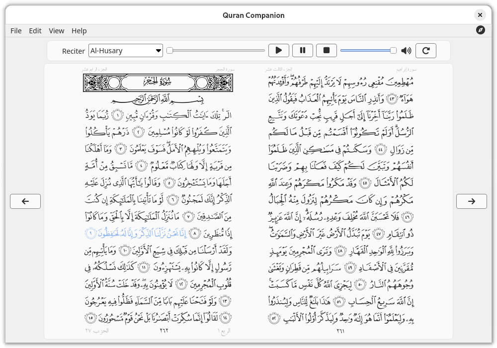

<a name="readme-top"></a>

<p align="center">
<span  dir="rtl">بسم الله الرحمن الرحيم</span>
</p>

<!-- PROJECT LOGO -->
<br />
<div align="center">
  <a href="https://github.com/0xzer0x/quran-companion">
    
  </a>
</div>

<h2 align="center">رفيق القرآن</h2>

<h4 align="center">
  قارئ و مشغل للقرآن الكريم متعدد-المنصات
</h4>

<p align="center">
  <a href="https://techforpalestine.org/learn-more"></a>
  
  <a href="https://aur.archlinux.org/packages/quran-companion"></a>
  
  
</p>

<p align="center">
    <a href="#key-features">أهم المميزات</a> •
    <a href="#screenshots">الصور</a> •
    <a href="#installation">التحميل</a> •
    <a href="#credits">الحقوق</a> •
    <a href="https://github.com/0xzer0x/quran-companion/issues">بلّغ عن مشكلة</a> •
    <a href="#license">الترخيص</a> 
</p>

<!-- TABLE OF CONTENTS -->
<div dir='rtl'>
<details>
  <summary>فهرس المحتويات</summary>
  <ol>
    <li>
      <a href="#about-the-project">عن المشروع</a>
    </li>
    <li>
      <a href="#key-features">أهم المميزات</a>
    <li>
      <a href="#screenshots">الصور</a>
    </li>
    </li>
    <li>
    <a href="#installation">التنصيب</a>
    </li>
    <li><a href="#compilation">البناء من المصدر</a>
        <ul>
          <li><a href="#dependencies">التبعيات</a></li>
          <li><a href="#build">البناء</a>
            <ul>
            <li><a href="#windows-build">ويندوز</a></li>
            <li><a href="#linux-build">لينكس</a></li>
            </ul>
          </li>
        </ul>
    </li>
    </li>
    <li><a href="#roadmap">خارطة الطريق</a></li>
    <li><a href="#contributing">المشاركة</a></li>
    <li><a href="#credits">الحقوق</a></li>
    <li><a href="#license">الترخيص</a></li>
    <li><a href="#contact">التواصل</a></li>

</ol>
</details>

<!-- ABOUT THE PROJECT -->

<a name="about-the-project"></a>

## عن المشروع ✨

رفيق القرآن هو برنامج متعدد-المنصات لقراءة و سماع القرآن الكريم مع إمكانية تحميل التلاوات، تظليل الآيات، حجم خط متغير للمصحف، و مجموعة مميزة من كتب التفسير و الترجمات

<a name="key-features"></a>

### أهم المميزات

<ul>
<li>واجهة عصرية تدعم الوضع الداكن</li>
<li>قراءة القرآن من صفحة المصحف أو قراءة ايآت الصفحة كلٌ على حدة</li>
<li>حجم صفحة المصحف قابل للتغيير</li>
<li>إمكانية تحميل تلاوات القرآن الكريم لمجموعة من المشايخ و القرّاء</li>
<li>تظليل الآية عند تلاوتها</li>
<li>مجموعة من كتب التفسير و الترجمات</li>
<li>خاصية البحث السريع في آيات القرآن الكريم</li>
</ul>

<p align="left">(<a href="#readme-top">عد إلى الأعلى</a>)</p>

<!-- SCREENSHOTS -->

<a name="screenshots"></a>

### الصور


#### الواجهة الإنجليزية





<p align="left">(<a href="#readme-top">عد إلى الأعلى</a>)</p>

<a name="installation"></a>

## التنصيب ⚙️

#### ويندوز

مثّبت البرنامج يمكنك تحميله من [هنا][win-installer]

#### ماك

1. قم بتحميل و فتح ملف [الdmg][macos-dmg-url].
2. قم بسحب البرنامج لمجلد التطبيقات.

#### لينكس

يمكنك تحميل البرنامج بأي صيغة من الصيغ المتوفرة (snap, flatpak, appimage, aur package)

<p align="right">
 <a href='https://flathub.org/apps/io.github._0xzer0x.qurancompanion'>
    
 </a>
 <a href='https://github.com/0xzer0x/quran-companion/releases/download/v1.3.1/Quran_Companion-1.3.1-x86_64.AppImage'>
    
 </a>
 <a href="https://snapcraft.io/quran-companion">
  
</a>
</p>

<p align="left">(<a href="#readme-top">عد إلى الأعلى</a>)</p>

<a name="compilation"></a>

## البناء من المصدر 🛠️

لإنشاء التطبيق في نظامك، ستحتاج إلى تثبيت التبعيات المطلوبة له وقد تختلف أسماء الحزم لكل توزيعة، راجع التبعيات أدناه لمزيد من المعلومات. يمكنك أيضا تثبيت معظم تبعيات Qt عبر [المثبت](https://www.qt.io/download-qt-installer). إذا كنت تقوم بتطوير تطبيقات Qt من قبل ، فمن المحتمل أن تكون لديك بالفعل. يستخدم هذا المشروع نظام بناء [CMake](https://cmake.org/) ، لذلك تحتاج إلى تثبيته من أجل بناء المشروع (في معظم توزيعات لينكس يتوفر في المستودعات الرئيسية كحزمة تسمى cmake). كما يمكنك فتح وبناء / تصحيح المشروع في بيئة تطوير لغة ++C متكاملة. على سبيل المثال ، في Qt Creator ، يجب أن تكون قادرا ببساطة على فتح "CMakeLists.txt" عبر "فتح ملف أو مشروع" في القائمة بعد تثبيت CMake في نظامك. [مزيد من المعلومات حول مشاريع CMake في Qt Creator](https://doc.qt.io/qtcreator/creator-project-cmake.html).

<p align="left">(<a href="#readme-top">عد إلى الأعلى</a>)</p>

<a name="dependencies"></a>

### التبعيات

<div dir='ltr'>

- GCC / MSVC
- CMake
- Qt >= 6.5
  - `qtbase`
  - `qtimageformats`
  - `qtsvg`
  - `qtmultimedia`
  - `qttools`

</div>

<a name="build"></a>

### البناء

<ol>
  <li>استنساخ المستودع</li>
</ol>

```sh
git clone --depth=1 -b main https://github.com/0xzer0x/quran-companion.git
```

<a name="windows-build"></a>

#### ويندوز

<ol start=2>
<li>قم بتثبيت Qt باستخدام <a href='https://www.qt.io/download-qt-installer'>المثبت عبر الانترنت</a></li>
<li>إضافة مجلد bin الخاص ب Qt لمسار البحث الخاص بالنظام (PATH)، في الأغلب يكون المسار <code dir='ltr'>C:\Qt\6.X.X\msvc_2019\bin</code>
</li>
<li>البناء (استبدل 6.x.x بنسخة Qt الخاصة بك)</li>
</ol>

```sh
mkdir build
cd build
cmake.exe -DCMAKE_PREFIX_PATH="C:\Qt\6.x.x\msvc_2019" -DCMAKE_BUILD_TYPE=Release ..
cmake.exe --build . --config Release
```

<a name="linux-build"></a>

#### لينكس

<ol start=2>
<li>تنصيب التبعيات</li>

**أوبونتو**

```sh
sudo apt install build-essential cmake qt6-tools-dev qt6-base-dev qt6-image-formats-plugins qt6-multimedia-dev qt6-l10n-tools qt6-translations-l10n
```

**آرش لينكس**

```sh
sudo pacman -Sy base-devel cmake qt6-base qt6-multimedia qt6-tools qt6-imageformats qt6-translations
```

<li>البناء</li>
</ol>

```sh
mkdir build
cd build
cmake -DCMAKE_BUILD_TYPE=Release -G "Ninja" ..
cmake --build .
```

<p align="left">(<a href="#readme-top">عد إلى الأعلى</a>)</p>

<!-- ROADMAP -->

<a name="roadmap"></a>

## خارطة الطريق 🎯

- [x] إضافة خاصية الآية اليومية
- [x] إضافة نافذة الايآت المفضلة
- [x] تحسين خاصية البحث
  - [x] البحث في نطاق عدد معين من الصفحات
  - [x] البحث في سور محددة فقط
- [x] إضافة كتب تفسير جديدة
  - [x] أيسر التفاسير - أبو بكر الجزائري
  - [x] التسهيل لعلوم التنزيل (تفسير إبن جزي)
  - [x] أضواء البيان - الشنقيطي

راجع [المشكلات المفتوحة](https://github.com/0xzer0x/quran-companion/issues) للحصول على قائمة كاملة بالميزات المقترحة (والمشكلات المعروفة).

<p align="left">(<a href="#readme-top">عد إلى الأعلى</a>)</p>

<!-- CONTRIBUTING -->

<a name="contributing"></a>

## المشاركة 💡

إذا كان لديك اقتراح من شأنه أن يجعل هذا أفضل ، فيرجى تفريع المستودع وإنشاء طلب سحب. يمكنك أيضا ببساطة فتح مشكلة باستخدام العلامة "تحسين".

### التوثيق 📚

- تم توثيق كافة أجزاء البرنامج باستخدام منهجية [Doxygen](https://www.doxygen.nl/) يمكنك بناء التوثيق في هيئة html عن طريق الخطوات التالية

<div dir='ltr'>

- `git clone https://github.com/0xzer0x/quran-companion.git`
- `cd quran-companion/docs`
- `doxygen`

</div>

### الترجمة 🌐

ألق نظرة على [هذه الصفحة][translation-wiki] (إنجليزية)

### التلاوات 📻

ألق نظرة على [هذه الصفحة][recitations-wiki] (إنجليزية)

<p align="left">(<a href="#readme-top">عد إلى الأعلى</a>)</p>

<!-- CREDITS -->

<a name="credits"></a>

## الحقوق 📌

تم استخدام المشاريع/المواقع التالية في تطوير البرنامج:

- [Ayat](https://quran.ksu.edu.sa/index.php)
- [Quran.com API](https://api-docs.quran.com/)
- [Every Ayah recitations](https://everyayah.com/recitations_ayat.html)
- [Mosshaf](https://mosshaf.com/)

<p align="left">(<a href="#readme-top">عد إلى الأعلى</a>)</p>

<!-- LICENSE -->

<a name="license"></a>

## الترخيص

مرخّص بموجب رخصة [وقف العامة](https://ojuba.org/waqf-2.0:%D8%B1%D8%AE%D8%B5%D8%A9_%D9%88%D9%82%D9%81_%D8%A7%D9%84%D8%B9%D8%A7%D9%85%D8%A9)

<p align="left">(<a href="#readme-top">عد إلى الأعلى</a>)</p>

<!-- CONTACT -->

<a name="contact"></a>

## التواصل

> 0xzer0x - y.essam2256@nu.edu.eg
>
> رابط المشروع: [https://github.com/0xzer0x/quran-companion](https://github.com/0xzer0x/quran-companion)

<p align="left">(<a href="#readme-top">عد إلى الأعلى</a>)</p>

</div>

<!-- MARKDOWN LINKS & IMAGES -->

[latest-release]: https://github.com/0xzer0x/quran-companion/releases/latest
[win-installer]: https://github.com/0xzer0x/quran-companion/releases/download/v1.1.9/qc_online_installer_x64_win.exe
[translation-wiki]: https://github.com/0xzer0x/quran-companion/wiki/Contributing-Translations
[recitations-wiki]: https://github.com/0xzer0x/quran-companion/wiki/Contributing-Recitations
[macos-dmg-url]: https://github.com/0xzer0x/quran-companion/releases/download/v1.3.1/Quran_Companion-1.3.1-x86_64.dmg
