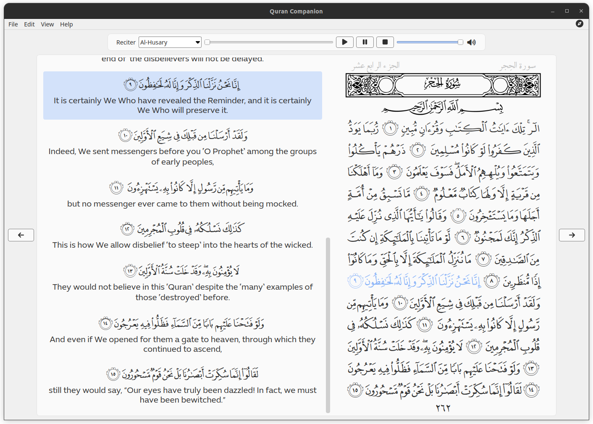
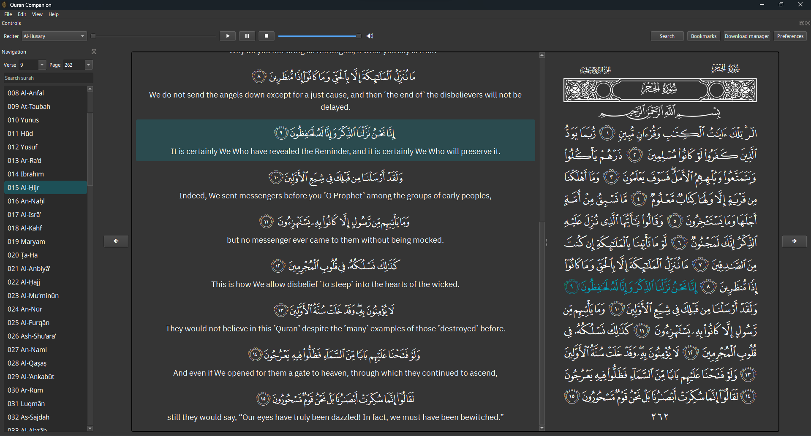
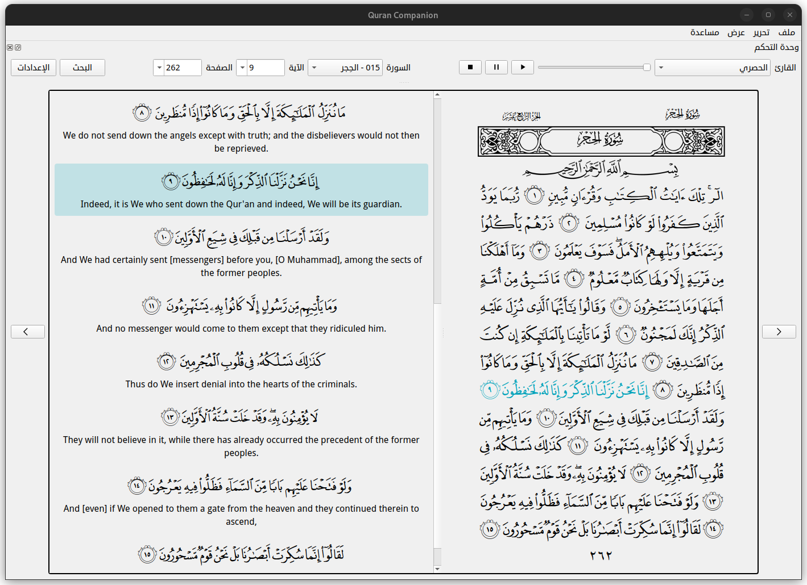
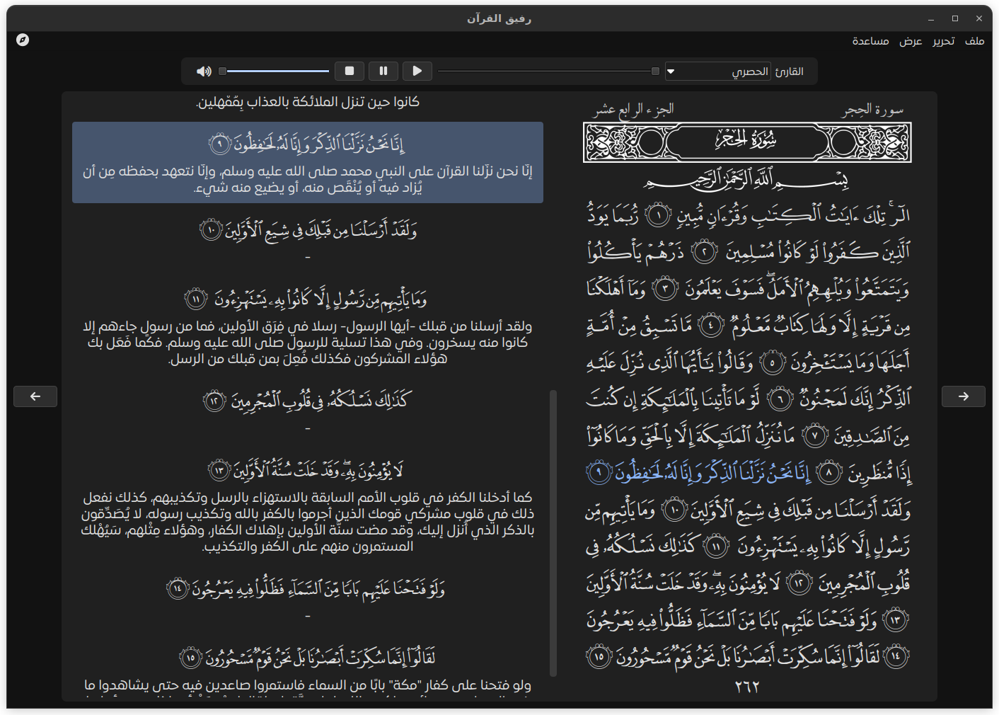
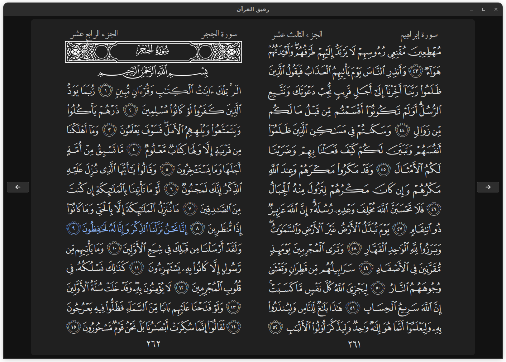

<a name="readme-top"></a>

<p align="center">
<span  dir="rtl">بسم الله الرحمن الرحيم</span>
</p>
<p align="center">
	<a href='README-AR.md'>العربية</a>
</p>
<!-- PROJECT LOGO -->
<br />
<div align="center">
  <a href="https://github.com/0xzer0x/quran-companion">
    
  </a>
</div>

<h2 align="center">Quran Companion</h2>

<h4 align="center">
  Cross-platform desktop Quran reader & player
</h4>

<p align="center">
  <a href="https://techforpalestine.org/learn-more"></a>
  
  <a href="https://aur.archlinux.org/packages/quran-companion"></a>
  
  
</p>

<p align="center">
    <a href="#key-features">Key Features</a> •
    <a href="#screenshots">Screenshots</a> •
    <a href="#installation">Download</a> •
    <a href="#credits">Credits</a> •
    <a href="https://github.com/0xzer0x/quran-companion/issues">Report Bug</a> •
    <a href="#license">License</a> 
</p>

<!-- TABLE OF CONTENTS -->

<details>
  <summary>Table of Contents</summary>
  <ol>
    <li>
      <a href="#about-the-project">About the project</a>
    </li>
    <li>
      <a href="#key-features">Key Features</a>
    <li>
      <a href="#screenshots">Screenshots</a>
    </li>
    </li>
    <li>
    <a href="#installation">Installation</a>
    </li>
    <li><a href="#compilation">Compilation</a>
        <ul>
          <li><a href="#dependencies">Dependencies</a></li>
          <li><a href="#build">Build</a>
            <ul>
            <li><a href="#windows-1">Windows</a></li>
            <li><a href="#linux-1">Linux</a></li>
            </ul>
          </li>
        </ul>
    </li>
    </li>
    <li><a href="#roadmap">Roadmap</a></li>
    <li><a href="#contributing">Contributing</a></li>
    <li><a href="#credits">Credits</a></li>
    <li><a href="#license">License</a></li>
    <li><a href="#contact">Contact</a></li>

</ol>
</details>

<!-- ABOUT THE PROJECT -->

<a name="about-the-project"></a>

## About the project ✨

Quran Companion is a cross-platform Quran reader/player with recitation download capabilities, verse highlighting, resizable quran font, and a variety of tafsir books & translations

### Key Features

- Modern UI with dark theme support
- Read the Quran from the mushaf page or read the page verses one-by-one
- Resizable Quran page size
- Quran recitation player
- Option for downloading recitations for a variety of reciters
- Verse highlighting as its read
- A collection of translations & tafsir books for the Quran
- Quran verse search functionality

<p align="right">(<a href="#readme-top">back to top</a>)</p>

<!-- SCREENSHOTS -->

### Screenshots





#### Arabic UI







<p align="right">(<a href="#readme-top">back to top</a>)</p>

<a name="installation"></a>

## Installation ⚙️

#### Windows

Online installer can be downloaded from [here][win-installer].

#### MacOS

1. Download and open the [application dmg][macos-dmg-url].
2. Drag the application into your _Applications_.

#### Linux

The application can be downloaded in any of the available packages (snap, flatpak, appimage, aur package).

<p align="left">
 <a href='https://flathub.org/apps/io.github._0xzer0x.qurancompanion'>
    
 </a>
 <a href='https://github.com/0xzer0x/quran-companion/releases/download/v1.2.5/Quran_Companion-1.2.5-x86_64.AppImage'>
    
 </a>
 <a href="https://snapcraft.io/quran-companion">
  
 </a>
</p>

<p align="right">(<a href="#readme-top">back to top</a>)</p>

<a name="compilation"></a>

## Compilation 🛠️

To build the application in your system, you'll need to install the dependencies needed for it and package names might be different for each distribution, see Dependencies below for more information. You can also install most of the Qt dependencies via their [installer](https://www.qt.io/download-qt-installer). If you were developing Qt apps before, you probably already have them.

This project uses [CMake](https://cmake.org/) build system, so you need to install it in order to build the project (on most Linux distributions it is available in the standard repositories as a package called cmake).

Also you can open and build/debug the project in a C++ IDE. For example, in Qt Creator you should be able to simply open `CMakeLists.txt` via `Open File or Project` in the menu after installing CMake into your system. [More information about CMake projects in Qt Creator](https://doc.qt.io/qtcreator/creator-project-cmake.html).

<p align="right">(<a href="#readme-top">back to top</a>)</p>

### Dependencies

- GCC / MSVC
- CMake
- Qt >= 6.5
  - `qtbase`
  - `qtimageformats`
  - `qtsvg`
  - `qtmultimedia`
  - `qttools`

### Build

1. Clone the repo, make sure to pass `--depth=1` to reduce the download size

```sh
git clone --depth=1 -b main https://github.com/0xzer0x/quran-companion.git
```

#### Windows

2. Install Qt using the [online installer](https://www.qt.io/download-qt-installer), make sure to select Qt Multimedia & Qt image formats

3. Add the Qt bin directory to the system **PATH** variable, usually `C:\Qt\6.x.x\msvc_2019\bin`

4. Build (replace 6.x.x with the Qt version you installed)

```sh
mkdir build
cd build
cmake.exe -DCMAKE_PREFIX_PATH="C:\Qt\6.x.x\msvc_2019" -DCMAKE_BUILD_TYPE=Release ..
cmake.exe --build . --config Release
```

#### Linux

2. Install dependencies (through the Qt [online installer](https://www.qt.io/download-qt-installer) or using your distro's package manager)

- **Ubuntu**

```sh
sudo apt install build-essential cmake qt6-tools-dev qt6-base-dev qt6-image-formats-plugins qt6-multimedia-dev qt6-l10n-tools qt6-translations-l10n ffmpeg
```

- **Arch linux**

```sh
sudo pacman -Sy base-devel cmake qt6-base qt6-multimedia qt6-tools qt6-imageformats qt6-translations ffmpeg
```

3. Build

**Note:** if you installed Qt through the online installer, you need to pass `-DCMAKE_PREFIX_PATH=~/Qt/6.x.x/gcc_64` to CMake in order for the linker to find the Qt libs

```sh
mkdir build
cd build
cmake -DCMAKE_BUILD_TYPE=Release ..
cmake --build .
```

<p align="right">(<a href="#readme-top">back to top</a>)</p>

<!-- ROADMAP -->

<a name="roadmap"></a>

## Roadmap 🎯

- [x] Add daily verse functionality
- [x] Add bookmarked verses tab
- [x] Enhance search functionality
  - [x] Search in a range of pages only
  - [x] Search in a specific surah only
- [x] Add new tafsir books
  - [x] Aysar Al-Tafasir (al-Jazaeri)
  - [x] al-Tashil li Ulum al-Tanzil (Ibn Juzayy)
  - [x] Adwa' ul-Bayan (al-Shinqiti)

See the [open issues](https://github.com/0xzer0x/quran-companion/issues) for a full list of proposed features (and known issues).

<p align="right">(<a href="#readme-top">back to top</a>)</p>

<!-- CONTRIBUTING -->

<a name="contributing"></a>

## Contributing 💡

If you have a suggestion that would make this better, please fork the repo and create a pull request. You can also simply open an issue with the tag "enhancement".

### Documetation 📚

- [Doxygen](https://www.doxygen.nl/) documentation is provided for the project, to generate the documentation preform the following steps

  - `git clone https://github.com/0xzer0x/quran-companion.git`
  - `cd quran-companion/docs`
  - `doxygen`

- default documentaion format is html, if you want to generate any other format modify `Doxyfile` accordingly

### Translation 🌐

Look at [this wiki page][translation-wiki]

### Recitations 📻

Look at [this wiki page][recitations-wiki]

<p align="right">(<a href="#readme-top">back to top</a>)</p>

<!-- CREDITS -->

<a name="credits"></a>

## Credits 📌

The following projects/services were used in development:

- [Ayat](https://quran.ksu.edu.sa/index.php)
- [Quran.com API](https://api-docs.quran.com/)
- [Every Ayah recitations](https://everyayah.com/recitations_ayat.html)
- [Mosshaf](https://mosshaf.com/)

<p align="right">(<a href="#readme-top">back to top</a>)</p>

<!-- LICENSE -->

<a name="license"></a>

## License

Distributed under the [Waqf General Public License](https://ojuba.org/waqf-2.0:%D8%B1%D8%AE%D8%B5%D8%A9_%D9%88%D9%82%D9%81_%D8%A7%D9%84%D8%B9%D8%A7%D9%85%D8%A9). See `license-en.txt` for the English version.

<p align="right">(<a href="#readme-top">back to top</a>)</p>

<!-- CONTACT -->

<a name="contact"></a>

## Contact

> 0xzer0x - y.essam2256@nu.edu.eg
>
> Project Link: [https://github.com/0xzer0x/quran-companion](https://github.com/0xzer0x/quran-companion)

<p align="right">(<a href="#readme-top">back to top</a>)</p>

<!-- MARKDOWN LINKS & IMAGES -->

[latest-release]: https://github.com/0xzer0x/quran-companion/releases/latest
[win-installer]: https://github.com/0xzer0x/quran-companion/releases/download/v1.1.9/qc_online_installer_x64_win.exe
[translation-wiki]: https://github.com/0xzer0x/quran-companion/wiki/Contributing-Translations
[recitations-wiki]: https://github.com/0xzer0x/quran-companion/wiki/Contributing-Recitations
[macos-dmg-url]: https://github.com/0xzer0x/quran-companion/releases/download/v1.2.5/Quran_Companion-1.2.5-x86_64.dmg
