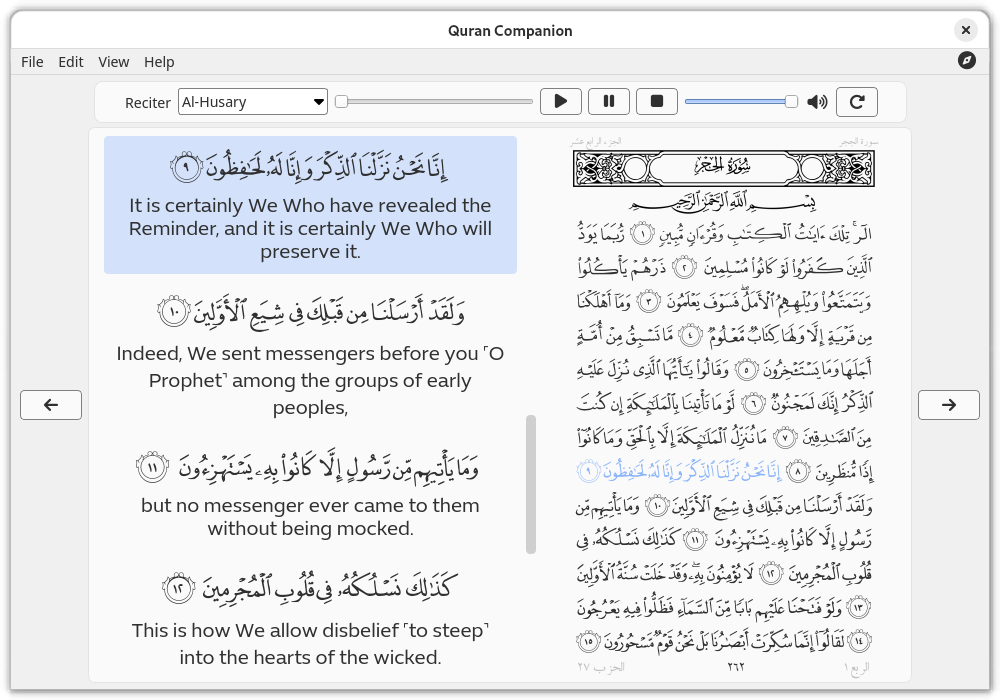
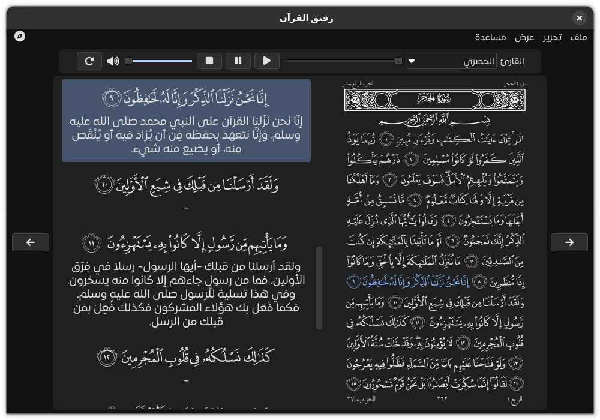

<a name="readme-top"></a>

<p align="center">
<span  dir="rtl">بسم الله الرحمن الرحيم</span>
</p>
<!-- PROJECT LOGO -->
<br />
<div align="center">
  <a href="https://github.com/0xzer0x/quran-companion">
    
  </a>

<h3 align="center">Quran Companion</h3>

  <p align="center">
    cross-platform Qt-based Quran reader/listener
    <br />
    <br />
    <a href="https://github.com/0xzer0x/quran-companion/releases/latest"></a> 
    <br />
    <a href="https://github.com/0xzer0x/quran-companion#screenshots">View Demo</a>
    ·
    <a href="https://github.com/0xzer0x/quran-companion/issues">Report Bug</a>
    ·
    <a href="https://github.com/0xzer0x/quran-companion/issues">Request Feature</a>
  </p>
</div>

<!-- TABLE OF CONTENTS -->
<details>
  <summary>Table of Contents</summary>
  <ol>
    <li>
      <a href="#about-the-project">About the project</a>
      <ul>
        <li><a href="#built-with">Built With</a></li>
      </ul>
    </li>
    <li>
      <a href="#features">Features</a>
    </li>
    <li>
    <a href="#installation">Installation</a>
      <ul>
        <li>
          <a href="#keyboard-shortcuts">Keyboard Shortcuts</a>
        </li>
      </ul>
    </li>
    <li><a href="#compilation">Compilation</a>
        <ul>
          <li><a href="#dependencies">Dependencies</a></li>
          <li><a href="#build">Build</a>
            <ul>
            <li><a href="#windows">Windows</a></li>
            <li><a href="#linux">Linux</a></li>
            </ul>
          </li>
        </ul>
    </li>
    </li>
    <li><a href="#screenshots">Screenshots</a></li>
    <li><a href="#roadmap">Roadmap</a></li>
    <li><a href="#contributing">Contributing</a></li>
    <li><a href="#license">License</a></li>
    <li><a href="#contact">Contact</a></li>
    <li><a href="#acknowledgments">Acknowledgments</a></li>

  </ol>
</details>

<!-- ABOUT THE PROJECT -->

## About the project

Quran Companion is a cross-platform Quran reader/listener with recitation download capabilities, verse highlighting, resizable quran font, and a variety of tafsir books & translations

### Features

- Modern UI with dark theme support
- Read the Quran from the mushaf page or read the page verses one-by-one
- Resizable Quran page size
- Quran recitation player
- Option for downloading recitations for a variety of reciters
- Verse highlighting as its read
- A collection of translations & tafsir books for the Quran
- Quran verse search functionality

<p align="right">(<a href="#readme-top">back to top</a>)</p>

### Built With

- [![qt-badge][qt-badge]][qt-url]

<p align="right">(<a href="#readme-top">back to top</a>)</p>

## Installation

- Online installers are provided for Windows & Linux in the [release page][latest-release], this is the recommended method as it provides updating functionality through the `QCMaintenanceTool`

### Keyboard Shortcuts

| Key                            | Description                     |
| ------------------------------ | ------------------------------- |
| <kbd>&#8592;</kbd>             | Next page                       |
| <kbd>&#8594;</kbd>             | Previous page                   |
| <kbd>Space</kbd>               | start/pause recitation playback |
| <kbd>Ctrl</kbd> + <kbd>B</kbd> | Open Bookmarks dialog           |
| <kbd>Ctrl</kbd> + <kbd>F</kbd> | Open Search dialog              |
| <kbd>Ctrl</kbd> + <kbd>P</kbd> | Open Preferences dialog         |
| <kbd>Ctrl</kbd> + <kbd>D</kbd> | Open the download manager       |
| <kbd>Ctrl</kbd> + <kbd>Q</kbd> | Exit                            |

<p align="right">(<a href="#readme-top">back to top</a>)</p>

## Compilation

To build the application in your system, you'll need to install the dependencies needed for it and package names might be different for each distribution, see Dependencies below for more information. You can also install most of the Qt dependencies via their [installer](https://www.qt.io/download-qt-installer). If you were developing Qt apps before, you probably already have them.

This project uses [CMake](https://cmake.org/) build system, so you need to install it in order to build the project (on most Linux distributions it is available in the standard repositories as a package called cmake).

Also you can open and build/debug the project in a C++ IDE. For example, in Qt Creator you should be able to simply open `CMakeLists.txt` via `Open File or Project` in the menu after installing CMake into your system. [More information about CMake projects in Qt Creator](https://doc.qt.io/qtcreator/creator-project-cmake.html).

<p align="right">(<a href="#readme-top">back to top</a>)</p>

### Dependencies

- GCC
- Qt >= 6.4
  - Qt Tools
  - Qt Multimedia
- CMake >= 3.22
- ffmpeg
- openssl

### Build

1. Clone the repo, make sure to pass `--depth=1` to reduce the download size

```sh
  git clone --depth=1 -b main https://github.com/0xzer0x/quran-companion.git
```

#### Windows

2. Install Qt using the [online installer](https://www.qt.io/download-qt-installer), make sure to select Qt Multimedia & Qt image formats

3. Add the Qt bin directory to the system **PATH** variable, usually `C:\Qt\6.X.X\mingw_64\bin`

4. Build (replace 6.x.x with the Qt version you installed)

```cmd
  mkdir build
  cd build
  cmake.exe -DCMAKE_PREFIX_PATH="C:\Qt\6.x.x\mingw_64" -DCMAKE_BUILD_TYPE=Release -G "Ninja" ..
  ninja
```

#### Linux

2. Install dependencies (through the Qt [online installer](https://www.qt.io/download-qt-installer) or using your distro's package manager)

- **Ubuntu**

```sh
sudo apt install build-essential cmake qt6-tools-dev qt6-base-dev qt6-image-formats-plugins qt6-multimedia-dev qt6-l10n-tools qt6-translations-l10n ffmpeg
```

- **Arch linux**

```sh
sudo pacman -Sy base-devel cmake qt6-base qt6-multimedia qt6-tools qt6-imageformats qt6-translations ffmpeg
```

3. Build

**Note:** if you installed Qt through the online installer, you need to pass `-DCMAKE_PREFIX_PATH=~/Qt/6.x.x/gcc_64` to CMake in order for the linker to find the Qt libs

```sh
  mkdir build
  cd build
  cmake ..
  make
```

4. If you're using Qt 6.4, you need to set the **QT_MEDIA_BACKEND** environmental variable to `ffmpeg` every time you run the executable, you could put the following snippet in a bash file to run the application

```sh
export QT_MEDIA_BACKEND=ffmpeg
./quran-companion
```

<p align="right">(<a href="#readme-top">back to top</a>)</p>

<!-- SCREENSHOTS -->

## Screenshots




### Arabic UI



<p align="right">(<a href="#readme-top">back to top</a>)</p>

<!-- ROADMAP -->

## Roadmap

- [ ] Add more tafsir books
- [ ] Add daily verse functionality
- [x] Add bookmarked verses tab
- [x] Enhance search functionality
  - [x] Search in a range of pages only
  - [x] Search in a specific surah only

See the [open issues](https://github.com/0xzer0x/quran-companion/issues) for a full list of proposed features (and known issues).

<p align="right">(<a href="#readme-top">back to top</a>)</p>

<!-- CONTRIBUTING -->

## Contributing

Contributions are what make the open source community such an amazing place to learn, inspire, and create. Any contributions you make are **greatly appreciated**.

If you have a suggestion that would make this better, please fork the repo and create a pull request. You can also simply open an issue with the tag "enhancement".
Don't forget to give the project a star! Thanks again!

<p align="right">(<a href="#readme-top">back to top</a>)</p>

<!-- LICENSE -->

## License

Distributed under the LGPL License. See `license.txt` for more information.

App icon by InkscapeBoy on [openclipart.org](https://openclipart.org/detail/221028/muslim-icon-quran)

<p align="right">(<a href="#readme-top">back to top</a>)</p>

<!-- CONTACT -->

## Contact

0xzer0x - y.essam2256@nu.edu.eg

Project Link: [https://github.com/0xzer0x/quran-companion](https://github.com/0xzer0x/quran-companion)

<p align="right">(<a href="#readme-top">back to top</a>)</p>

<!-- ACKNOWLEDGMENTS -->

## Acknowledgments

- [Ayat](https://quran.ksu.edu.sa/index.php)
- [Quran.com API](https://quran.api-docs.io/)
- [Every Ayah recitations](https://everyayah.com/recitations_ayat.html)

<p align="right">(<a href="#readme-top">back to top</a>)</p>

<!-- MARKDOWN LINKS & IMAGES -->

[latest-release]: https://github.com/0xzer0x/quran-companion/releases/latest
[qt-badge]: https://shields.io/badge/Qt-Framework-green?logo=qt&style=for-the-badge
[qt-url]: https://qt.io
